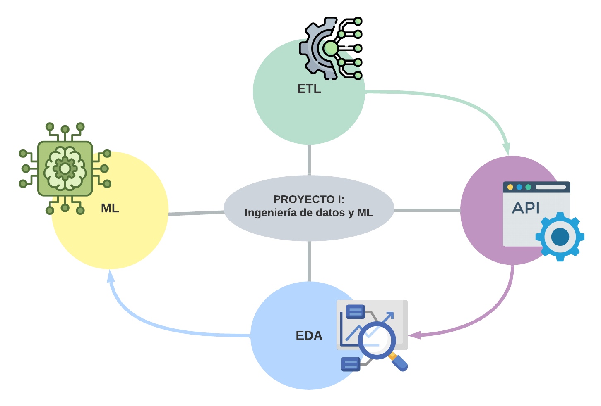

<h1 align=center> PROYECTO I: Ingeniería de Datos y ML</h1>

Este proyecto se divide en cuatro etapas, las cuales se muestran en el siguiente diagrama:

<h2 align=center> ETL </h2>
Se realizaron las siguienter transformaciones a los datos extraidos de .csv proveniente de la carpeta `data`:  
1. Se generó el campo id: Cada ide está conformado por la primera letra de la plataforma seguido del show_id ya presente anteriormente en los datasets.   
2. Los valores nulos del campo 'rating' fueron sustituidos por la cadena "G" (Correspondiente al maturity rating: "General for all audiences").  
3. Se modificó la columna de fechas para que cumplieran con el formato AAA-MM-DD.  
4. Se separo el campo 'duration' en  'duration_int' y 'duration_type'.

<h2 align=center> API </h2>
Se desarrolló una API utilizando el Framework FastAPI. Las consultas disponibles son las siguientes:  
- / : Home  
- get_max_duration/year/platform/duration_type: Película con mayor duración con filtros de año, plataforma y tipo de duración.  

Link de acceso a la API: https://api-ml-ops-lljd.onrender.com

Link opcional: https://api-ml-ops-lljd.onrender.com/docs

